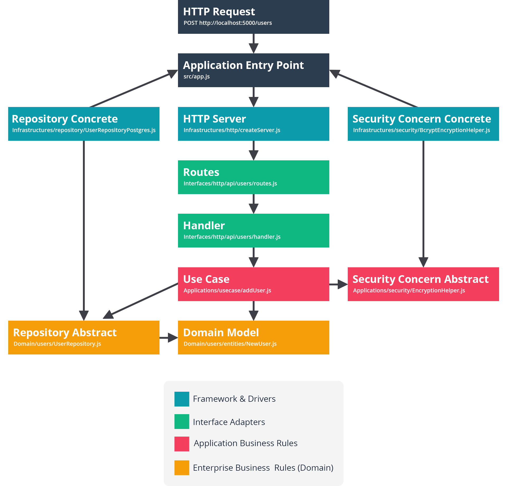

## Mengenal Struktur Proyek

Sebelum memulai latihan, pahami dulu struktur proyek yang akan dibangun. Jadi, proyek Auth API akan memiliki empat struktur folder besar, yaitu **Domains, Applications, Interfaces**, dan **Infrastructures**.

- **Domains**: Merupakan Enterprise Business Layer, di dalam folder ini terdapat model domain (entities) dan abstract/interface repository. Di folder ini diharapkan untuk tidak ada dependencies (sintaks require atau import) terhadap agen external seperti framework atau tools luar.

- **Applications**: Merupakan Application Business Layer, di dalam folder ini terdapat alur bisnis yang kita definisikan dalam bentuk use case. Selain itu, kita juga bisa meletakkan abstraksi atau interface dari services, helper, tools, dan lainnya yang digunakan oleh use case. Di folder ini juga diharapkan untuk tidak ada dependencies langsung terhadap framework atau tools luar. Use Case diperbolehkan memiliki dependencies atau menggunakan domain karena domain berada di dalam lingkarannya.

- **Interfaces**: Merupakan adapter atau jembatan penghubung antara use case dengan agen eksternal, seperti HTTP server. Di sini kita akan mendefinisikan routes configuration dan juga handler yang dibungkus dengan Hapi Plugin.

- **Infrastructures**: Merupakan letak agen eksternal seperti framework, HTTP Server, Database, JWT Token, Bcrypt dan sebagainya. Di folder ini juga kita mendefinisikan concrete repository dari Domain, atau concrete service, helper, tools dari Application.

    
> Penamaan folder disesuaikan berdasarkan empat layer aplikasi pada konsep Domain-Driven Design. Konsep tersebut dikemukakan oleh Eric Evans melalui bukunya yang berjudul <a href="https://www.pearson.com/us/higher-education/program/Evans-Domain-Driven-Design-Tackling-Complexity-in-the-Heart-of-Software/PGM168436.html" target="_blank">Domain-Driven Design: Tackling Complexity in the Heart of Software</a>.

Selain empat folder besar tersebut, kita juga menambahkan satu folder tambahan yakni Commons. Folder ini merupakan shared folder yang berisi class, function, atau apa pun yang boleh digunakan oleh ke-empat folder tersebut. Contohnya, kita akan mendefinisikan custom exception agar dapat menangani error secara spesifik.

> Agar kode bisnis tetap bersih, kode yang berada di folder Domains dan Applications akan menghindari penggunaan shared folder.

## Alur Kontrol

Supaya lebih memahami cara kerja fungsi dan struktur proyek, silakan simak dengan seksama bagan dari alur control aplikasi berikut.

*Alur Kontrol*

Seperti yang tampak pada bagan di atas, kita membagi struktur aplikasi menjadi empat folder yakni Infrastructures (biru), Interfaces (hijau), Applications (merah), dan Domains (kuning). Berikut penjelasan dari alur tersebut:

1. Client melakukan request POST /users untuk membuat user baru.
2. Request masuk ke HTTP server yang dijalankan oleh Application Entry Point.
3. Request tersebut akan diarahkan oleh routes dan ditangani oleh handler yang sesuai.
4. Handler menangani request dari client dengan memanggil addUser use case dan memberikan request payload dari client sebagai use case payload. Handler memiliki objek repository dan security concern concrete yang dibawa dari entry point -> server -> routes -> handler. Di mana objek concrete tersebut juga diberikan kepada use case oleh handler agar ia dapat menjalankan tugasnya.
5. addUser Use case menerima tugas dari handler dan mengolah use case payload menjadi domain model NewUser. Setelah memiliki domain model, use case akan meminta UserRepository untuk menyimpan NewUser pada database.
6. UserRepository akan menyimpan NewUser dan mengembalikan nilai yang dibutuhkan Use Case untuk dijadikan response oleh handler terhadap permintaan client.

Kira-kira seperti itulah alur proses aplikasi yang akan kita bangun. Mungkin sebagian dari Anda masih ada yang belum memahami sepenuhnya alur dari aplikasi yang hendak dibuat. Tidak apa-apa, seiring praktik pemahaman Anda akan semakin matang. 

## Anatomi Proyek

Sebelum melangkah ke materi selanjutnya, ada baiknya Anda mengenal anatomi proyek yang akan kita bangun secara lebih detail terlebih dahulu. Simaklah anatominya di bawah ini.

    auth-api/                   → Root Proyek.
    ├─ config/                  → Folder konfigurasi, digunakan untuk mengonfigurasi node-pg-migrate pada database testing.
    ├─ migrations/              → Berkas migrations database.
    ├─ src/                     → Source code aplikasi
    │  ├─ Applications/         → Application Business Rules
    │  │  ├─ security/          → Abstraksi/interface dari tools dan helper dalam hal security yang digunakan pada use case. Contohnya AuthTokenManager dan EncryptionHelper
    │  │  ├─ use_cases/         → Alur bisnis aplikasi.
    │  ├─ Commons/              → Shared folder.
    │  │  ├─ exceptions/        → Custom exceptions.
    │  ├─ Domains/              → Enterprise Business Rules.
    │  │  ├─ authentications/   → Subdomain authentications, di sini berisi domain model (entities) dan abstraksi/interface AuthenticationRepository .
    │  │  ├─ users/             → Subdomain users, di sini berisi domain model (entities) dan abstraksi/interface UserRepository.
    │  ├─ Infrastructures/      → Agen External seperti Framework dan Tools External.
    │  │  ├─ database/          → Driver database.
    │  │  ├─ http/              → HTTP Server menggunakan Hapi.js.
    │  │  ├─ repositories/      → Objek konkrit/implementasi dari repository domain.
    │  │  ├─ security/          → Objek konkrit/implementasi dari tools dan helper dalam hal security.
    │  │  ├─ container.js       → Penampung (container) seluruh instance dari service yang digunakan aplikasi.
    │  ├─ Interfaces/           → Interface Adapter. Di sini kita akan mendefinisikan routes configuration dan juga handler yang dibungkus dengan Hapi Plugin.
    │  ├─ app.js                → Entry point aplikasi.
    ├─ tests/                   → Utilitas kebutuhan untuk testing.
    ├─ .env                     → Environment variable.
    ├─ package.json             → Project Manifest.
